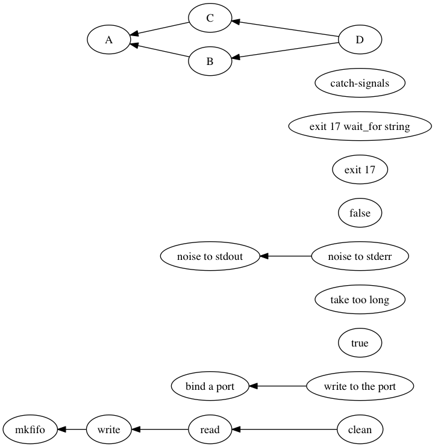

depends-on
==========

Manages the external services that your tests depend on. Think of it as [async.auto](https://github.com/caolan/async#auto) with process control for integration tests.

[](https://travis-ci.org/robert-chiniquy/depends-on)

## examples

`dependencies.json` is a file describing your dependencies. Keep it next to your tests.

### … with one dependency

`test-thing.js`:
```javascript
var ready = require('depends-on')('redis');
var test = require('tape');

test('init dependencies for ' + __filename, ready);

test('test that uses redis', function(t) {
  …
});
```

`dependencies.json`:
```json
{
  "redis": {
    "cmd": ["/usr/sbin/redis-server"],
    "wait_for": {
      "port": 6379
    }
  }
}
```

`ready()` is a function that takes a callback (or a tape test object). It will call that callback when your dependencies are ready. They'll be stopped automatically when your tests are done.

### … with multiple dependencies

Dependencies can have dependencies. This is the typical use case, where multiple services must start before your tests can run.

Building on the previous example, say you want to clear all values from (or load some fixtures into) Redis after it starts, but before your tests run.

`test-other-thing.js`:
```javascript
var ready = require('depends-on')('fresh & clean redis');
var test = require('tape');

test('start fresh redis', ready);

test('test that uses redis', function(t) {
  …
});
```

`dependencies.json`:
```json
{
  "redis-server": {
    "cmd": ["/usr/sbin/redis-server"],
    "wait_for": {
      "port": 6379
    }
  },
  "fresh & clean redis": {
    "cmd": ["./bin/flushall.sh"],
    "depends": ["redis-server"],
    "wait_for": {
      "exit_code": 0
    }
  }
}
```

If multiple tests are `require()`'d and share dependencies, depends-on will share them across the test files, each dependency only being started once. When node exits, all dependencies will stopped (by default with `SIGTERM` but the signal is configurable).

## dependencies.json
`dependencies.json` is a file containing a json object mapping dependency names to objects that describe each dependency.

### dependency fields

<dl>
<dt>cmd</dt>
<dd>array of command and args for child_process.spawn</dd>

<dt>depends</dt>
<dd>array of names of dependencies which this dependency depends on</dd>

<dt>cwd</dt>
<dd>The cwd to pass to child_process.spawn</dd>

<dt>wait_for</dt>
<dd>object specifying a timeout and either an exit code or ip & port to wait for socket availability before considering a dependency started</dd>

<dt>signal</dt>
<dd>signal to use to stop the dependency when your tests end (default: `SIGTERM` )</dd>

<dt>stdout</dt>
<dd>path to log dependency's stdout to (default: your stdout). This can be relative to either the `cwd` value you specify or `__dirname` of `dependencies.json`.</dd>

<dt>stderr</dt>
<dd>path to log dependency's stderr to (default: your stderr). This can be relative to either the `cwd` value you specify or `__dirname` of `dependencies.json`.</dd>

<dt>truncateStdio</dt>
<dd>boolean, if true files stdio is piped to will be truncated on use</dd>


</dl>

### wait_for fields

You can wait for either a socket to be accepting connections or for a process to exit, so one of `port` or `exit_code` is required to use `wait_for`.

```json
    "wait_for": {
      "host": "127.0.0.1",
      "port": 22181,
      "timeout": 30
    }
```

By default, depends-on will throw an error if one of the processes it starts exits before your tests are done. Use an `exit_code` in your `wait_for` block if a process is expected to complete and exit prior to tests running (maybe you're loading a db schema).

```json
    "wait_for": {
      "exit_code": 0,
      "timeout": 120
    }
```

<dl>

<dt>host</dt>
<dd>default: localhost</dd>

<dt>port</dt>
<dd>if port is set, will wait for a TCP connection to be accepted on this port</dd>

<dt>exit_code</dt>
<dd>if exit_code is set, will wait for the process to exit with this code before proceeding</dd>

<dt>timeout</dt>
<dd>seconds to wait before considering a dependency to have failed starting up (default: 30)</dd>

</dl>

## graph dependencies

Just for fun, `bin/graph-dependencies.js` can graph the dependencies in your project with graphviz.

For example, graphing [the dependencies in this repo's fixtures](https://github.com/robert-chiniquy/depends-on/blob/master/tests/dependencies.json):
`dot -Tpng -odeps.png <(./bin/graph-dependencies.js) && open deps.png` ->



## notes
### using with tape
Be sure to `require('depends-on')` before you `require('tape')`. Like this:

```javascript
var ready = require('depends-on')('something');
var test = require('tape');
```

Both depends-on and tape have `process.on('exit', …)` handlers, but tape calls `process.exit` in its `process.on('exit', …)` handler, so if tape's handler runs first, depends-on's handler will never run (and child processes won't be cleaned up). Handlers run in the order they are added, so depends-on must be required first.

### why not
#### … use a bash script or Makefile?

I like to be able to run integration tests individually like `$ node tests.js` without running anything else or relying on some external service coincidentally being on.

